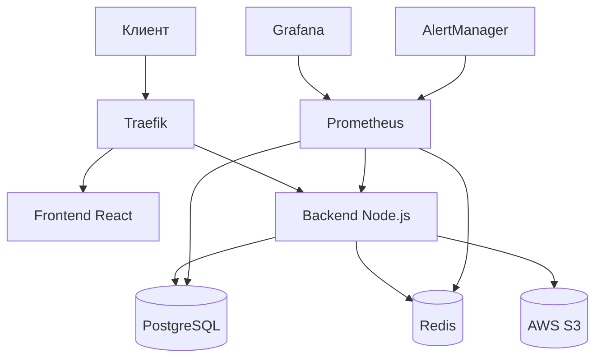
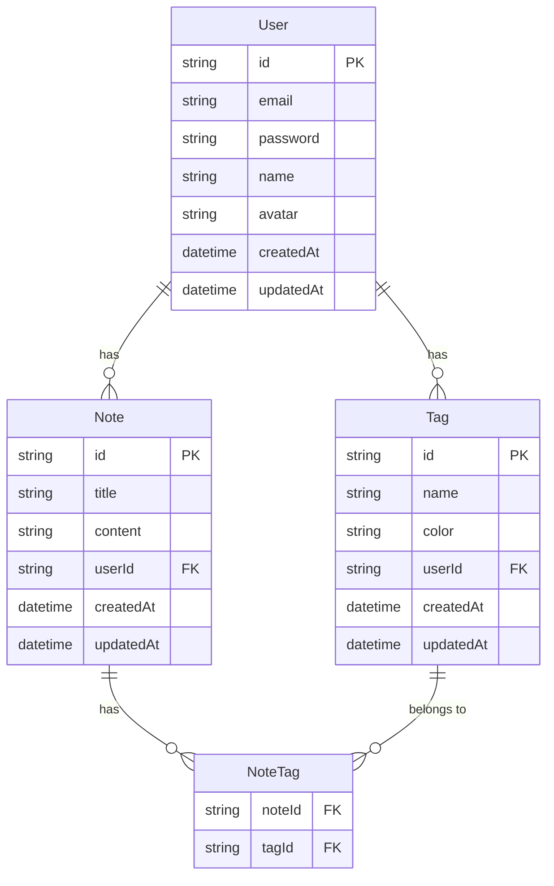

# Архитектура проекта

## 🏗️ Общая структура



## 📦 Компоненты

### Frontend (React + TypeScript)
- **Технологии**:
  - React 18
  - TypeScript
  - Vite
  - TailwindCSS
  - React Query
  - Zustand
  - React Router
  
- **Структура**:
  ```
  app/
  ├── src/
  │   ├── components/    # Переиспользуемые компоненты
  │   ├── pages/        # Страницы приложения
  │   ├── hooks/        # Кастомные хуки
  │   ├── store/        # Управление состоянием
  │   ├── api/          # API клиент
  │   ├── utils/        # Утилиты
  │   └── types/        # TypeScript типы
  ```

### Backend (Node.js + TypeScript)
- **Технологии**:
  - Node.js
  - TypeScript
  - Express
  - Prisma
  - JWT
  - Winston
  
- **Структура**:
  ```
  api/
  ├── src/
  │   ├── controllers/  # Обработчики запросов
  │   ├── services/     # Бизнес-логика
  │   ├── models/       # Модели данных
  │   ├── middleware/   # Middleware
  │   ├── utils/        # Утилиты
  │   └── config/       # Конфигурация
  ```

### Desktop (Electron)
- **Технологии**:
  - Electron
  - TypeScript
  - electron-store
  - electron-updater
  
- **Структура**:
  ```
  electron/
  ├── src/
  │   ├── main/        # Основной процесс
  │   ├── preload/     # Preload скрипты
  │   └── utils/       # Утилиты
  ```

## 🗄️ База данных

### PostgreSQL Schema



### Индексы
- `User.email`: Уникальный индекс
- `Note.userId`: Индекс для быстрого поиска
- `Tag.userId`: Индекс для быстрого поиска
- `Note.title`: Полнотекстовый поиск
- `Note.content`: Полнотекстовый поиск

## 🔒 Безопасность

### Аутентификация
- JWT токены
- Хеширование паролей (bcrypt)
- Rate limiting
- CORS настройки

### WAF (ModSecurity)
- Защита от SQL инъекций
- Защита от XSS
- Защита от CSRF
- Защита от Path Traversal
- Защита от Command Injection

### Traefik
- SSL/TLS
- HTTP/2
- Secure Headers
- IP Whitelisting
- Basic Auth для админ панелей

## 📊 Мониторинг

### Метрики приложения
- Latency запросов
- Количество запросов
- Ошибки
- Использование памяти
- CPU usage

### Метрики базы данных
- Активные соединения
- Время выполнения запросов
- Cache hit ratio
- Размер базы данных
- WAL size

### Метрики Redis
- Memory usage
- Connected clients
- Commands per second
- Cache hit ratio
- Evicted keys

### Алерты
- Высокая латентность API
- Ошибки в приложении
- Высокая нагрузка на CPU/Memory
- Disk space warnings
- Database connection issues

## 💾 Бэкапы

### Стратегия
- Ежедневные полные бэкапы
- Инкрементальные бэкапы каждые 6 часов
- Хранение бэкапов за последние 30 дней
- Шифрование бэкапов

### Данные для бэкапа
- База данных PostgreSQL
- Загруженные файлы
- Конфигурационные файлы
- Логи

## 🔄 CI/CD

### GitHub Actions
- Линтинг
- Тесты
- Сборка Docker образов
- Деплой на staging
- Деплой на production

### Окружения
- Development
- Staging
- Production

### Процесс деплоя
1. Push в main
2. Запуск тестов
3. Сборка образов
4. Деплой на staging
5. Автотесты на staging
6. Деплой на production

## 📈 Масштабирование

### Горизонтальное масштабирование
- Frontend: Через CDN
- Backend: Множество инстансов
- База данных: Read replicas

### Кеширование
- Redis для сессий
- Redis для API кеширования
- CDN для статических файлов

### Оптимизация
- Индексы в базе данных
- Query optimization
- Code splitting
- Lazy loading
- Image optimization 