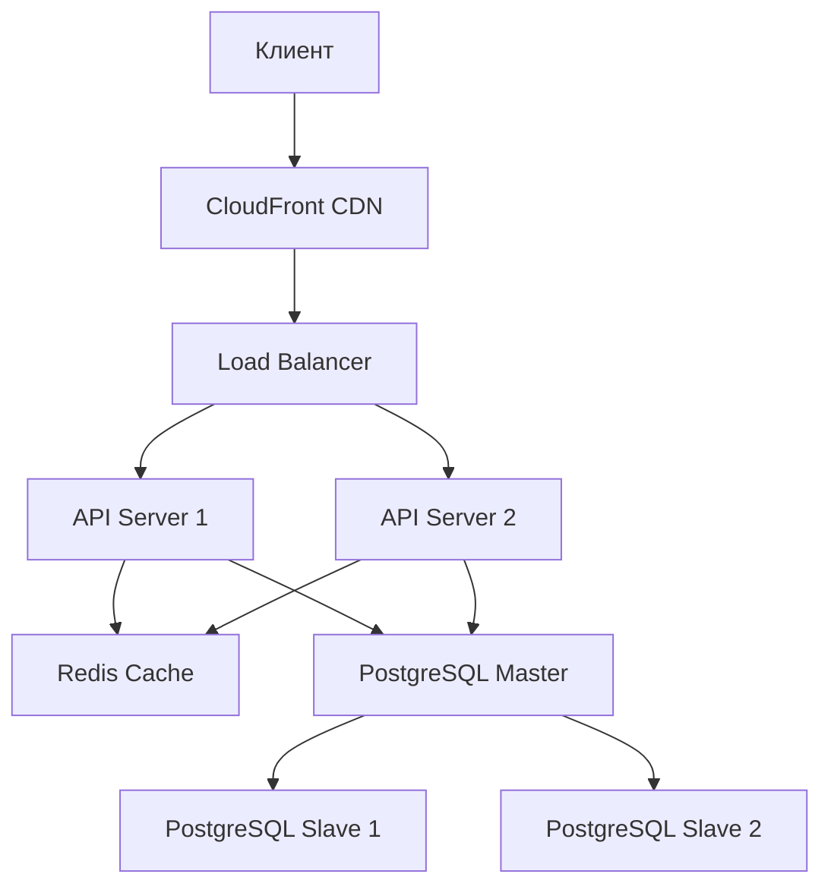
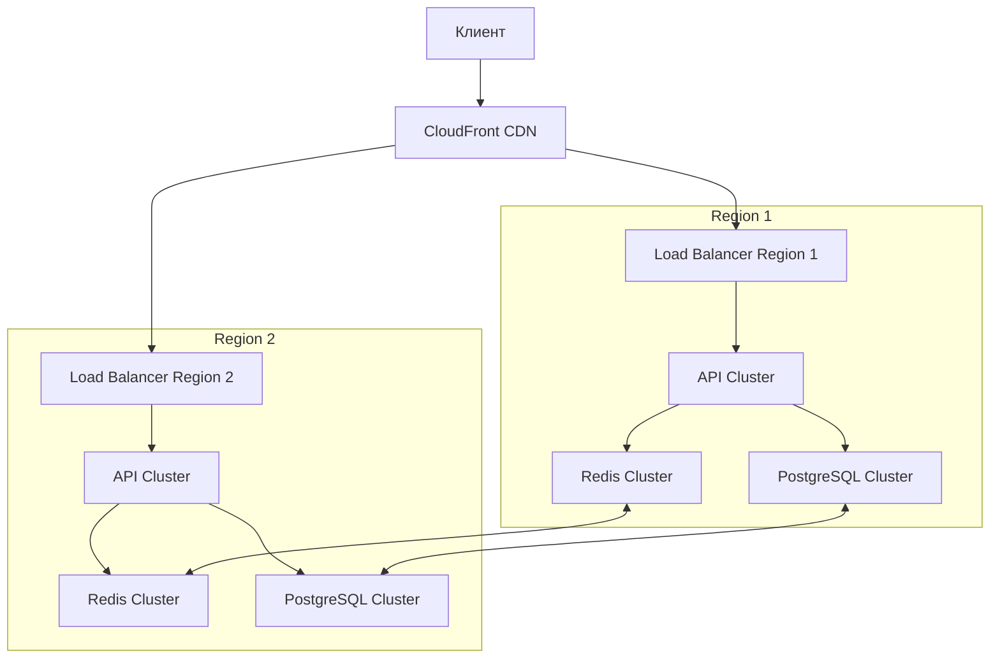

# Масштабирование

## 🏗️ Архитектура

### Текущая архитектура


### Целевая архитектура


## 🚀 Горизонтальное масштабирование

### API Серверы

```yaml
# docker-compose.prod.yml
services:
  api:
    image: user/notio-api:latest
    deploy:
      mode: replicated
      replicas: 3
      update_config:
        parallelism: 1
        delay: 10s
      restart_policy:
        condition: on-failure
      resources:
        limits:
          cpus: '0.50'
          memory: 512M
        reservations:
          cpus: '0.25'
          memory: 256M
```

### База данных

```yaml
# docker-compose.prod.yml
services:
  postgres-master:
    image: bitnami/postgresql-repmgr:14
    environment:
      - POSTGRESQL_POSTGRES_PASSWORD=adminpassword
      - POSTGRESQL_USERNAME=customuser
      - POSTGRESQL_PASSWORD=custompassword
      - POSTGRESQL_DATABASE=notio
      - REPMGR_PASSWORD=repmgrpassword
      - REPMGR_PRIMARY_HOST=postgres-master
      - REPMGR_PARTNER_NODES=postgres-master,postgres-slave-1,postgres-slave-2
      - REPMGR_NODE_NAME=postgres-master
      - REPMGR_NODE_NETWORK_NAME=postgres-master
    volumes:
      - postgres_master_data:/bitnami/postgresql

  postgres-slave-1:
    image: bitnami/postgresql-repmgr:14
    environment:
      - POSTGRESQL_POSTGRES_PASSWORD=adminpassword
      - POSTGRESQL_USERNAME=customuser
      - POSTGRESQL_PASSWORD=custompassword
      - POSTGRESQL_DATABASE=notio
      - REPMGR_PASSWORD=repmgrpassword
      - REPMGR_PRIMARY_HOST=postgres-master
      - REPMGR_PARTNER_NODES=postgres-master,postgres-slave-1,postgres-slave-2
      - REPMGR_NODE_NAME=postgres-slave-1
      - REPMGR_NODE_NETWORK_NAME=postgres-slave-1
    volumes:
      - postgres_slave1_data:/bitnami/postgresql
```

### Redis Cluster

```yaml
# docker-compose.prod.yml
services:
  redis-master:
    image: bitnami/redis:6.2
    environment:
      - REDIS_REPLICATION_MODE=master
      - REDIS_PASSWORD=masterpassword
    volumes:
      - redis_master_data:/bitnami/redis/data

  redis-replica:
    image: bitnami/redis:6.2
    environment:
      - REDIS_REPLICATION_MODE=slave
      - REDIS_MASTER_HOST=redis-master
      - REDIS_MASTER_PASSWORD=masterpassword
      - REDIS_PASSWORD=replicapassword
    volumes:
      - redis_replica_data:/bitnami/redis/data
```

## 📈 Вертикальное масштабирование

### Оптимизация Node.js

```javascript
// src/config/cluster.ts
import cluster from 'cluster';
import os from 'os';

if (cluster.isMaster) {
  const numCPUs = os.cpus().length;
  
  console.log(`Master ${process.pid} is running`);
  
  // Fork workers
  for (let i = 0; i < numCPUs; i++) {
    cluster.fork();
  }
  
  cluster.on('exit', (worker, code, signal) => {
    console.log(`Worker ${worker.process.pid} died`);
    // Replace the dead worker
    cluster.fork();
  });
} else {
  // Workers can share any TCP connection
  require('./server');
}
```

### Оптимизация PostgreSQL

```sql
-- postgresql.conf
max_connections = 200
shared_buffers = 4GB
effective_cache_size = 12GB
maintenance_work_mem = 1GB
checkpoint_completion_target = 0.9
wal_buffers = 16MB
default_statistics_target = 100
random_page_cost = 1.1
effective_io_concurrency = 200
work_mem = 20MB
min_wal_size = 1GB
max_wal_size = 4GB
max_worker_processes = 8
max_parallel_workers_per_gather = 4
max_parallel_workers = 8
```

### Оптимизация Redis

```conf
# redis.conf
maxmemory 2gb
maxmemory-policy allkeys-lru
activerehashing yes
no-appendfsync-on-rewrite yes
hash-max-ziplist-entries 512
hash-max-ziplist-value 64
list-max-ziplist-size -2
zset-max-ziplist-entries 128
zset-max-ziplist-value 64
```

## 🔄 Балансировка нагрузки

### Traefik конфигурация

```yaml
# traefik/traefik.yml
http:
  services:
    api:
      loadBalancer:
        servers:
          - url: "http://api1:3000"
          - url: "http://api2:3000"
          - url: "http://api3:3000"
        healthCheck:
          path: /health
          interval: "10s"
          timeout: "3s"
        sticky:
          cookie:
            name: srv_id
            secure: true
```

### Nginx конфигурация

```nginx
# nginx/nginx.conf
upstream api_servers {
    least_conn;
    server api1:3000;
    server api2:3000;
    server api3:3000;
    keepalive 32;
}

server {
    listen 80;
    server_name api.example.com;

    location / {
        proxy_pass http://api_servers;
        proxy_http_version 1.1;
        proxy_set_header Upgrade $http_upgrade;
        proxy_set_header Connection 'upgrade';
        proxy_set_header Host $host;
        proxy_cache_bypass $http_upgrade;
        proxy_set_header X-Real-IP $remote_addr;
    }
}
```

## 📊 Мониторинг производительности

### Prometheus метрики

```yaml
# prometheus/rules/performance.yml
groups:
- name: performance
  rules:
  - alert: HighCPUUsage
    expr: avg(rate(process_cpu_seconds_total[5m])) > 0.8
    for: 5m
    labels:
      severity: warning
    annotations:
      summary: High CPU usage

  - alert: HighMemoryUsage
    expr: process_resident_memory_bytes > 1.5e9
    for: 5m
    labels:
      severity: warning
    annotations:
      summary: High memory usage

  - alert: SlowQueries
    expr: histogram_quantile(0.95, rate(http_request_duration_seconds_bucket[5m])) > 1
    for: 5m
    labels:
      severity: warning
    annotations:
      summary: Slow API responses
```

### Grafana Dashboard

```json
{
  "title": "Performance Overview",
  "panels": [
    {
      "title": "API Response Time",
      "type": "graph",
      "datasource": "Prometheus",
      "targets": [
        {
          "expr": "histogram_quantile(0.95, rate(http_request_duration_seconds_bucket[5m]))"
        }
      ]
    },
    {
      "title": "Database Connections",
      "type": "graph",
      "datasource": "Prometheus",
      "targets": [
        {
          "expr": "pg_stat_activity_count"
        }
      ]
    },
    {
      "title": "Redis Memory Usage",
      "type": "graph",
      "datasource": "Prometheus",
      "targets": [
        {
          "expr": "redis_memory_used_bytes"
        }
      ]
    }
  ]
}
```

## 🔄 Автоматическое масштабирование

### Kubernetes HPA

```yaml
# k8s/hpa.yml
apiVersion: autoscaling/v2
kind: HorizontalPodAutoscaler
metadata:
  name: api-hpa
spec:
  scaleTargetRef:
    apiVersion: apps/v1
    kind: Deployment
    name: api
  minReplicas: 3
  maxReplicas: 10
  metrics:
  - type: Resource
    resource:
      name: cpu
      target:
        type: Utilization
        averageUtilization: 70
  - type: Resource
    resource:
      name: memory
      target:
        type: Utilization
        averageUtilization: 80
```

### Docker Swarm

```yaml
# docker-compose.prod.yml
services:
  api:
    deploy:
      mode: replicated
      replicas: 3
      update_config:
        parallelism: 1
        delay: 10s
      restart_policy:
        condition: on-failure
      resources:
        limits:
          cpus: '0.50'
          memory: 512M
      placement:
        constraints:
          - node.role == worker
```

## 📝 Чеклист масштабирования

### Подготовка
- [ ] Анализ текущей нагрузки
- [ ] Определение узких мест
- [ ] Планирование ресурсов
- [ ] Тестирование производительности

### Реализация
- [ ] Настройка репликации БД
- [ ] Настройка Redis кластера
- [ ] Развертывание API серверов
- [ ] Настройка балансировщика

### Мониторинг
- [ ] Настройка метрик
- [ ] Создание дашбордов
- [ ] Настройка алертов
- [ ] Тестирование отказоустойчивости

### Оптимизация
- [ ] Оптимизация запросов
- [ ] Настройка кеширования
- [ ] Оптимизация конфигурации
- [ ] Тестирование производительности 